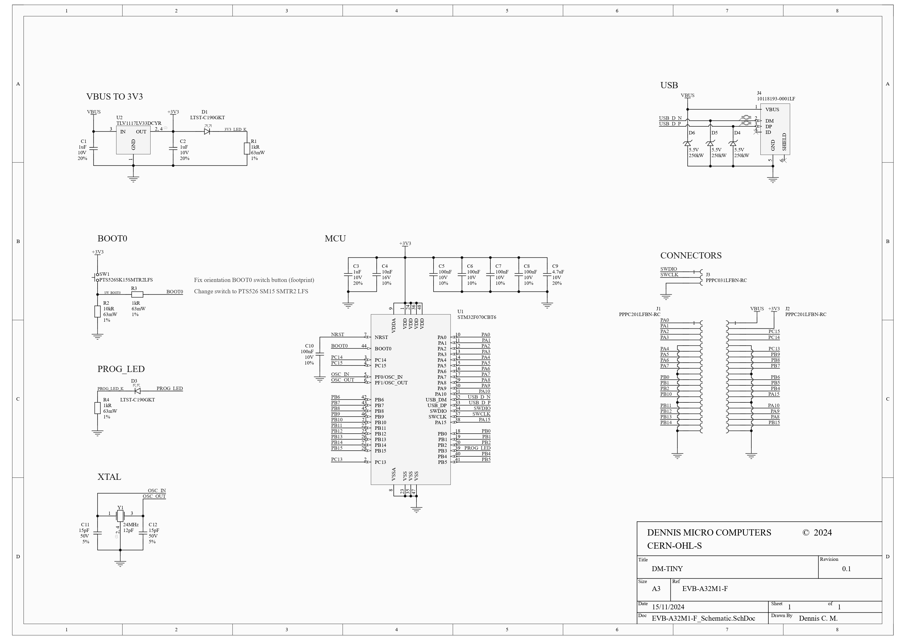

# EVB-A32M1-F

A small STM32F0 development board with the same dimensions as the Raspberry Pi Pico. In the `Export` folder you can find an overview of the schematic, PCB and bill of materials.

## Schematic 

## PCB 

## BOM 

